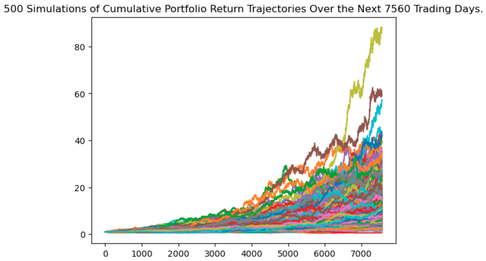

# financial-planning-monte-carlo
Uses monte carlo simulations to plan for emergencies and retirement. Allows you to simulate different investment strategies over a specified timespan to try and harness the capitol a user has to retire early and save money.

---

## Technologies
Jupyter, Pandas, Numpy, Pathlib, Alpaca, MonteCarlo, OS, Requests, JSON, API's and dotenv.

---

## Installation Guide
Not applicable at the moment, will be released at a later date.

---

## Usage

---

## Contributors

Name: Keenan Heller 
Email: keenanaheller@gmail.com 
LinkedIn: https://www.linkedin.com/in/keenanheller/ 
---

## License

MIT License
